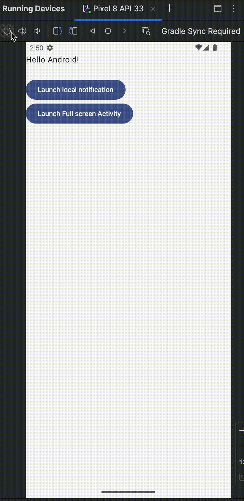

# 🔒 Full-Screen Intent Over Lock Screen – Android Sample

This is a minimal Android sample demonstrating how to launch a **full-screen activity over the lock screen** using a local notification and intent.

The goal is to simulate real-world use cases like **incoming call UIs**, **alarm apps**, or **emergency alerts** that require user attention even when the device is locked.

---

## 🚀 Features

- Shows a **full-screen activity** (like an incoming call screen) while the device is locked.
- Includes a **button on the main screen** that triggers a local notification after a 5-second delay.
- Gives the user time to **lock the screen manually** before the full-screen intent fires.

---

## 🧪 How It Works

1. Open the app and tap the **"Send Notification"** button.
2. A 5-second timer starts in the background.
3. Within those 5 seconds, **lock your device**.
4. Once the timer completes, a **notification is triggered** that launches a full-screen activity on top of the lock screen.

---

## 📸 Preview



---

## 🧱 Implementation Highlights

- Uses `NotificationCompat.Builder` with:
  ```kotlin
  setFullScreenIntent(pendingIntent, true)
  ```
- Includes required permission for posting notification:
```xml
    <uses-permission android:name="android.permission.POST_NOTIFICATIONS" />
```
- Includes required permission for full-screen behavior:
```xml
    <uses-permission android:name="android.permission.USE_FULL_SCREEN_INTENT" />
```
- Configured proper `NotificationChannel` for high-importance alerts.
- The full-screen activity has these flags to ensure it shows over lock:
  ```xml
  android:showWhenLocked="true"
  android:turnScreenOn="true"
  ```

---

## 🛠 Requirements

- Android 10 (API 29) and above recommended.
- Tested on:
    - Pixel emulator (Android 13–15)
    - Real Samsung tablet (Android 13)

---

## 📦 How to Run

1. Clone the repo:
   ```bash
   git clone https://github.com/rahul-lohra/AndroidLockScreenNotification.git
   ```

2. Open in Android Studio and run on a physical/emulated device.

---

## 📝 Notes

- This is a local-only implementation (no server-side push).
- Works best on **Pixel devices and emulators** where full-screen intents are not blocked.
- Some OEMs (like Xiaomi, Samsung) may require extra battery or lock screen permission tweaks.

---

## 📄 License

MIT License. Feel free to use, modify, and build upon it.

---

Would you like help inserting a sample code snippet or GIF in the README?